# N8N Workflow Validator Skill

## When to Activate This Skill

Automatically activate when:

- 📊 User shares n8n workflow JSON
- 📊 Reviewing workflow before production deployment
- 📊 Debugging workflow execution failures
- 📊 User mentions "workflow não funciona"
- 📊 Optimizing existing workflow performance

## Validation Layers

### 🔍 Layer 1: Structural Integrity

**Check 1: Orphaned Nodes**

```javascript
// Nodes that have NO incoming or outgoing connections
// (except designated entry points like Webhook, Manual Trigger)

ACCEPTABLE orphans:
- Webhook (entry point)
- Manual Trigger (entry point)
- Schedule Trigger (entry point)

UNACCEPTABLE orphans:
- Data processing nodes
- Agent sub-nodes (LLM, Memory, Tools)
- Output formatters with no downstream
```

**Check 2: Dead-End Nodes**

```javascript
// Nodes that receive input but send NOWHERE
// (except designated exit points like HTTP Response, Final Output)

ACCEPTABLE dead-ends:
- HTTP Request to external webhook (fire-and-forget)
- Respond to Webhook
- Final Set node before workflow end

UNACCEPTABLE dead-ends:
- Agent node that doesn't connect to output
- Vector Store node in "insert" mode with no confirmation
- Formatted data that never gets sent/stored
```

**Check 3: Duplicate Functionality**

```javascript
// Multiple nodes doing the same thing

RED FLAGS:
- Two HTTP Embedding nodes for same input
- Two Agent nodes processing same message
- Multiple Set nodes extracting same fields
- Parallel paths for no clear reason (should merge)
```

---

### 🔗 Layer 2: Connection Topology

**Check 1: Agent Subgraph Validation**

```javascript
// Every Agent node MUST have:
✅ 1 LLM connected (ai_languageModel)
✅ 0-1 Memory connected (ai_memory) - optional but recommended
✅ 1+ Tools connected (ai_tool)

// Every Tool MUST have:
✅ Tool-specific connections (e.g., Vector Store for retrieval tools)

// Every Vector Store (in tool context) MUST have:
✅ 1 Embedding node connected (ai_embedding)

CORRECT:
Agent ← Gemini (LLM)
      ← Postgres Memory
      ← Tool Vector Store
           ← Supabase Vector Store
                ← Embeddings OpenAI

INCORRECT:
Agent ← Gemini
      ← Tool Vector Store (missing!)
           ← Embeddings (orphaned!)
```

**Check 2: Main Flow Continuity**

```javascript
// Trace main execution path from entry to exit

Entry → Process → Transform → Output
 ✅      ✅         ✅         ✅

Entry → Process → [gap!] → Output
 ✅      ✅        ❌        ⚠️
```

**Check 3: Parallel Branch Merging**

```javascript
// If workflow splits, branches should merge before final output

        ┌→ Branch A ─┐
Entry ──┤            ├→ Merge → Output ✅
        └→ Branch B ─┘

        ┌→ Branch A → Output A
Entry ──┤                        ❌ (divergent, no merge)
        └→ Branch B → Output B
```

---

### 📝 Layer 3: Expression Validation

**Check 1: Variable Scope**

```javascript
// {{ $json.field }} - references current node input
// {{ $('NodeName').item.json.field }} - references specific node

COMMON MISTAKES:
❌ {{ $json.workspace_id }} in Node B, but Node A doesn't pass it
❌ {{ $('Node Name With Space').json }} - spaces break reference
❌ {{ $node['Node-Name'].json }} - use $() notation, not $node[]
```

**Check 2: Null Safety**

```javascript
// Always check for existence before accessing nested properties

❌ UNSAFE:
value: "={{ $json.body.body.workspace_id }}"
// Fails if body.body is undefined

✅ SAFE:
value: "={{ $json.body?.body?.workspace_id || 'default-uuid' }}"
```

**Check 3: Type Coercion**

```javascript
// n8n is loose with types, but downstream expects specific formats

❌$json.count (could be string "5")
✅ parseInt($json.count)

❌ $json.timestamp
✅ new Date($json.timestamp).toISOString()

❌ $json.is_active (could be "true" string)
✅ $json.is_active === true || $json.is_active === 'true'
```

---

### 🔐 Layer 4: Credentials & Security

**Check 1: Missing Credentials**

```javascript
// Nodes that require credentials but have none set

CRITICAL (blocks execution):
- OpenAI nodes → openAiApi
- Supabase nodes → supabaseApi
- Postgres nodes → postgres
- HTTP Request with authentication → httpBasicAuth/httpHeaderAuth

SCAN FOR:
"credentials": {}  // Empty = missing!
```

**Check 2: Hardcoded Secrets**

```javascript
// Secrets exposed in workflow JSON

❌ RED FLAGS:
"apikey": "sk-abc123..."
"password": "mypassword"
"token": "Bearer xxx"

✅ CORRECT:
"authentication": "predefinedCredentialType"
"nodeCredentialType": "openAiApi"
```

**Check 3: Service Role vs Anon Key**

```javascript
// Supabase credentials context

USE service_role FOR:
- RPC calls that bypass RLS
- Backend automation (n8n workflows)
- Bulk operations

USE anon key FOR:
- Frontend client-side calls
- User-scoped operations with RLS
```

---

### ⚙️ Layer 5: LangChain-Specific Validation

**Check 1: Agent Configuration**

```yaml
REQUIRED:
  - promptType: "define" (not "auto")
  - text: (non-empty prompt)

RECOMMENDED:
  - options.temperature: ≤ 0.3 for tool-heavy agents
  - options.maxIterations: 3-5 (prevent infinite loops)

CONNECTIONS:
  - ai_languageModel: EXACTLY 1
  - ai_memory: 0 or 1
  - ai_tool: 1 or more
```

**Check 2: Vector Store Mode**

```yaml
MODE: "load" (retrieve documents)
  - Used in: Agent tools, search workflows
  - Requires: tableName, queryName (or default)

MODE: "insert" (add documents)
  - Used in: Data ingestion, FAQ upload
  - Requires: tableName, documentInput

MODE: "update" (modify documents)
  - Rarely used
  - Requires: id + new content

⚠️ COMMON MISTAKE:
Using "load" mode in main flow (should be tool-only)
```

**Check 3: Embedding Consistency**

```javascript
// All embedding nodes in same workflow should use SAME model

✅ CONSISTENT:
Node A: text-embedding-3-small (1536 dims)
Node B: text-embedding-3-small (1536 dims)

❌ INCONSISTENT:
Node A: text-embedding-3-small (1536 dims)
Node B: text-embedding-ada-002 (1536 dims but different space!)
// Vectors mathematically incompatible
```

---

### 🎯 Layer 6: Performance & Best Practices

**Check 1: Unnecessary HTTP Requests**

```javascript
// Embedding generation via HTTP vs native node

❌ SLOW (2 nodes):
HTTP Request (generate embedding) → Agent

✅ FAST (1 node ecosystem):
Agent → Tool → Vector Store → Embeddings (auto)
```

**Check 2: Sequential vs Parallel**

```javascript
// Independent operations should run in parallel

❌ SLOW (sequential):
Node A → Node B → Node C (1s + 1s + 1s = 3s total)

✅ FAST (parallel):
       ┌→ Node A (1s) ─┐
Entry ─┤→ Node B (1s) ─┤→ Merge
       └→ Node C (1s) ─┘
// Total: 1s (max of parallel branches)
```

**Check 3: Memory Window Size**

```yaml
Postgres Memory:
  contextWindowLength: 10  ✅ (good balance)
  contextWindowLength: 100 ❌ (too much context = slow + expensive)
  contextWindowLength: 2   ❌ (too little = agent forgets quickly)
```

---

## 🛠️ Validation Procedures

### Procedure 1: Quick Health Check (30 seconds)

```bash
1. Count nodes: Should be 5-15 for typical workflow
2. Count connections: Should be ≥ (nodes - 1)
3. Find entry point: 1 Webhook/Trigger
4. Find exit point: 1 Response/HTTP Request out
5. Scan for "credentials": {} → Flag missing
```

### Procedure 2: Deep Structural Scan (2 minutes)

```bash
1. Build adjacency list from connections
2. Detect orphaned nodes (no in/out edges)
3. Detect cycles (infinite loops)
4. Validate AI subgraphs (Agent + LLM + Tools)
5. Check expression scopes (variable availability)
```

### Procedure 3: Pre-Production Audit (5 minutes)

```bash
1. Run Procedure 1 + 2
2. Test with mock data (pinData or manual execute)
3. Check all nodes turn green (success)
4. Validate output format matches expected schema
5. Review Agent logs for tool usage
6. Confirm no hardcoded workspace IDs
7. Verify error handling (add error branch if missing)
```

---

## 📋 Deployment Checklist

Before moving workflow to production:

**Structure:**

- [ ] No orphaned nodes (except entry points)
- [ ] No dead-end nodes (except exit points)
- [ ] All Agent nodes have LLM + Tools
- [ ] All Vector Store tools have Embeddings

**Security:**

- [ ] All credentials configured (no `{}`)
- [ ] No hardcoded API keys in JSON
- [ ] Using service_role for Supabase RPC
- [ ] Workspace isolation enforced in filters

**Expressions:**

- [ ] All `{{ $json }}` references valid
- [ ] All `{{ $('NodeName') }}` nodes exist
- [ ] Null safety for nested properties
- [ ] Type coercion where needed

**LangChain:**

- [ ] Agent temperature ≤ 0.3
- [ ] Tool descriptions are explicit
- [ ] Vector Store queryName specified
- [ ] Embeddings model consistent across workflow

**Testing:**

- [ ] Executed with real data
- [ ] All nodes completed successfully
- [ ] Output format validated
- [ ] Agent logs show tool calls
- [ ] No errors in execution logs

**Performance:**

- [ ] No duplicate HTTP embedding nodes
- [ ] Parallel branches used where possible
- [ ] Memory window size reasonable (10-20)
- [ ] No unnecessary data transformations

---

## 🚨 Common Anti-Patterns & Fixes

### Anti-Pattern 1: The Orphaned HTTP Embedding

```javascript
// PROBLEM:
Webhook → organiza-dados → HTTP Embedding → Agent
                                   ↑
                               (orphaned! Agent has own embedding)

// FIX:
Webhook → organiza-dados → Agent
                           (Agent uses internal embedding via Tool)
```

---

### Anti-Pattern 2: LLM Connected to Tool

```javascript
// PROBLEM:
Gemini → Agent ✅
Gemini → Tool ❌ (tools don't need separate LLM)

// FIX:
Only connect Gemini to Agent, not to Tools
```

---

### Anti-Pattern 3: Multiple Set Nodes for Same Data

```javascript
// PROBLEM:
Node A → Set (extract fields) → Node B → Set (extract same fields again)

// FIX:
Node A → Set (extract once) → Node B (reuse $json from Set)
```

---

### Anti-Pattern 4: Dynamic topK in Production

```javascript
// PROBLEM (in Vector Store Tool):
"topK": "={{ $fromAI('limit', 'How many?', 'number') }}"
// Agent can request 1, 10, or 1000 - inconsistent!

// FIX:
"topK": 5  // Fixed integer
```

---

### Anti-Pattern 5: Missing Error Handling

```javascript
// PROBLEM:
Happy path only, no error branches

// FIX:
Add "On Error" workflow or IF node:
  ┌→ Success → Output
  ├→ Error → Log + Notify
```

---

## 🧪 Testing Strategies

### Test 1: Minimal Viable Input

```json
// Smallest possible input that should work
{
  "body": {
    "mensagem": "test",
    "workspace_id": "valid-uuid"
  }
}
```

### Test 2: Edge Cases

```json
// Empty message
{"body": {"mensagem": "", "workspace_id": "..."}}

// Special characters
{"body": {"mensagem": "R$ 299,99", "workspace_id": "..."}}

// Very long message
{"body": {"mensagem": "a".repeat(10000), "workspace_id": "..."}}
```

### Test 3: Multi-Tenant Isolation

```json
// Execute with workspace A
{"workspace_id": "aaaa-..."}
// Should NOT return data from workspace B

// Then execute with workspace B
{"workspace_id": "bbbb-..."}
// Should NOT return data from workspace A
```

---

## 📊 Topology Patterns (Good vs Bad)

### Pattern: Linear Flow ✅

```
Webhook → Process → Transform → Output
```

**Good for:** Simple ETL, data pipelines

---

### Pattern: Conditional Branch ✅

```
        ┌→ IF true → Action A
Entry ──┤
        └→ IF false → Action B
```

**Good for:** Decision trees, classification

---

### Pattern: Parallel + Merge ✅

```
       ┌→ Task A ─┐
Entry ─┤          ├→ Merge → Output
       └→ Task B ─┘
```

**Good for:** Independent operations (sentiment + embedding)

---

### Pattern: Diamond (merge-split-merge) ⚠️

```
       ┌→ Split ─┐
Entry ─┤         ├→ Merge1 ─┬→ Split2 ─┐
       └─────────┘           └─────────┤→ Merge2
```

**Warning:** Complex, ensure all paths handled

---

### Pattern: Spaghetti (avoid!) ❌

```
A ↔ B
↕   ↕
C ↔ D → E → C (cycle!)
```

**Problem:** Cycles, unclear flow, debugging nightmare

---

## 💡 Optimization Tips

### Tip 1: Merge Early

```javascript
// BAD:
Branch A → Transform A → Format A → Output A
Branch B → Transform B → Format B → Output B

// GOOD:
Branch A ─┐
          ├→ Merge → Transform → Format → Output
Branch B ─┘
```

### Tip 2: Cache Expensive Operations

```javascript
// If same embedding used multiple times:

Instead of:
  Task 1 → Generate Embedding
  Task 2 → Generate Embedding (duplicate!)

Do:
  Generate Embedding → Task 1
                    → Task 2 (reuse)
```

### Tip 3: Batch Where Possible

```javascript
// Instead of loop calling RPC 100 times:
FOR each item:
  Call RPC(item)

// Use bulk operation:
Call RPC(all_items)  // 1 call instead of 100
```

---

## 🎯 Success Criteria

Workflow is production-ready when:

1. ✅ Passes all 6 validation layers
2. ✅ Deployment checklist 100% complete
3. ✅ Tested with ≥3 different inputs
4. ✅ Multi-tenant isolation verified
5. ✅ Error handling implemented
6. ✅ Performance acceptable (<5s for typical request)
7. ✅ Logs are clean (no warnings)
8. ✅ Credentials secured (no hardcoded secrets)

---

## 🔄 Validation Workflow

```mermaid
graph TD
    A[Receive Workflow JSON] --> B[Layer 1: Structure]
    B --> C[Layer 2: Connections]
    C --> D[Layer 3: Expressions]
    D --> E[Layer 4: Credentials]
    E --> F[Layer 5: LangChain]
    F --> G[Layer 6: Performance]
    G --> H{All Pass?}
    H -->|Yes| I[Production Ready ✅]
    H -->|No| J[Generate Fix Report]
    J --> K[Apply Fixes]
    K --> B
```



---

## 📚 Reference: n8n Node Type Categories

**Entry Points:** Webhook, Manual Trigger, Schedule, Email Trigger  
**Data Sources:** HTTP Request (GET), Supabase (Read), Database Query  
**Transformations:** Set, Code, Function, Split  
**AI/LLM:** Agent, Chat Model, Embeddings, Vector Store, Memory  
**Outputs:** HTTP Request (POST), Supabase (Insert), Respond to Webhook  
**Control Flow:** IF, Switch, Merge, Split

---

## 🔗 Integration with Other Skills

- Use **RAG N8N Debugger** to validate Agent tool connections
- Use **Agent Prompt Optimizer** to validate prompt quality
- Use **Multi-Tenant SQL** to validate RPC function calls

---

## ⚡ Quick Fixes for Common Issues

| Issue                                   | Quick Fix                                                   |
| --------------------------------------- | ----------------------------------------------------------- |
| "Node not found" error                  | Check node name has no typos, no special chars              |
| Credentials missing                     | Configure in Settings → Credentials                         |
| Expression error                        | Wrap in `{{ }}`, check $json path exists                    |
| Agent ignores tool                      | Lower temperature, improve prompt                           |
| Vector search returns empty             | Check queryName matches SQL function                        |
| Workflow times out                      | Add parallel execution, check for loops                     |
| "JSON parameter needs to be valid JSON" | Check for `==` (double equals), escape special chars        |
| "faqText.replace is not a function"     | Input is not string, check OpenAI nested output structure   |
| Empty response from OpenAI              | Use `input.output[0].content[0].text` for nested extraction |

---

## 🆕 OpenAI Output Extraction Patterns

### Problem: OpenAI returns nested structure

The OpenAI node in n8n may return responses in different structures:

```javascript
// Structure 1: Simple
input.text = "Response text";

// Structure 2: Nested (common with newer versions)
input.output[0].content[0].text = "Response text";
```

### Solution: Safe extraction code

```javascript
const input = $input.first().json;

let resposta = "";

// Try multiple structures
if (
  input.output &&
  input.output[0] &&
  input.output[0].content &&
  input.output[0].content[0]
) {
  resposta = input.output[0].content[0].text || "";
} else if (typeof input.text === "string") {
  resposta = input.text;
} else if (typeof input.message === "string") {
  resposta = input.message;
} else if (typeof input.output === "string") {
  resposta = input.output;
} else {
  resposta = "Fallback response";
}

resposta = String(resposta).trim();
```

---

## 🆕 JSON Body Validation (HTTP Request)

### Common Error: Double equals sign

**❌ WRONG:**

```json
"jsonBody": "=={\"input\": \"{{ $json.mensagem }}\"..."
```

**✅ CORRECT:**

```json
"jsonBody": "={\"input\": \"{{ $json.mensagem }}\"..."
```

### Escape special characters in JSON

```javascript
// Safe message for embedding
"jsonBody": "={\"input\": \"{{ $json.mensagem.replace(/\"/g, '\\\\\"').replace(/\\n/g, ' ') }}\", \"model\": \"text-embedding-3-small\"}"
```

### Pre-process in Code node (recommended)

```javascript
const dados = $input.first().json;

const mensagemLimpa = String(dados.mensagem || "")
  .replace(/"/g, "'")
  .replace(/\n/g, " ")
  .replace(/\r/g, "")
  .replace(/\t/g, " ")
  .replace(/\\/g, "")
  .trim()
  .substring(0, 2000);

return [{ json: { ...dados, mensagem_limpa: mensagemLimpa } }];
```

---

## 🆕 deepFind Pattern (Nested Data)

When data can be deeply nested (webhooks, subflows), use:

```javascript
function deepFind(obj, key, maxDepth = 6) {
  if (!obj || maxDepth === 0) return null;
  if (obj[key] !== undefined && obj[key] !== null && obj[key] !== "")
    return obj[key];
  for (const k of Object.keys(obj)) {
    if (typeof obj[k] === "object" && obj[k] !== null) {
      const found = deepFind(obj[k], key, maxDepth - 1);
      if (found !== null) return found;
    }
  }
  return null;
}

// Usage
const telefone = deepFind(input, "telefone") || "";
const workspace_id = deepFind(input, "workspace_id") || "";
```
